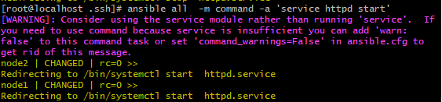
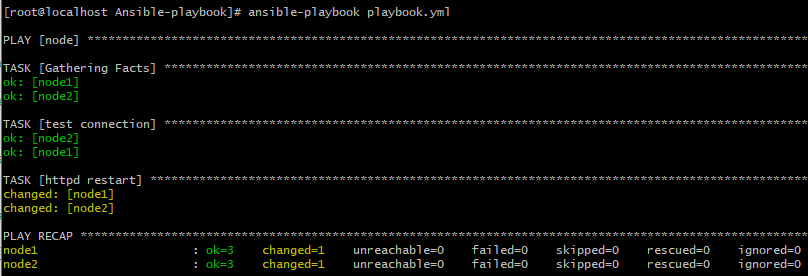

# Ansible

## Ansible是什麼?

Ansible的命名是取至於作者最愛的小說"安德的遊戲"，在2013年也翻拍成電影"戰爭遊戲"，片中主角用來控制無數戰艦的超光速通訊裝置其名稱就叫做Ansible，所以有了它我們就可以像操作戰艦一般指揮伺服器。


言歸正傳，Ansible是一種配合Python使用的組態管理工具，且只需要SSH和Python即可快速使用，並較容易上手。

## Get Started

### Step 1 部屬Ansible

在開始之前我們需要先知道Ansible是如何運作的，在Ansible裡有幾個角色需要先知道
- 1.Control Machine(控制端):控制端指的就是我們主要會在上面操控Ansible的機器，並透過inventory定義"被控端"，並藉由SSH以及Python進行溝通
- 2.Managed Node(被控端):在Ansible裡被控制的機器

#### inventory 是什麼？
inventory 就單字本身有詳細目錄、清單和列表的意思。在這裡我們可以把它當成是一份主機列表，我們可透過它對定義每個 Managed Node 的代號、IP 位址、連線相關資訊和群組。

#### 安裝Ansible

在一般的情況下，我們只需在 Control Machine 裡安裝 Ansible 即可，因為 GNU/Linux 和 macOS 的 Managed node 都早已預載了 Python 2.5 以上的版本，且開通了 SSH 連線的條件。

#### 在 Control Machine 上安裝 Ansible

##### Ubuntu (Apt)
1. 安裝 add-apt-repository 必要套件。
```
$ sudo apt-get install -y python-software-properties software-properties-common
```
2. 使用 Ansible 官方的 PPA 套件來源。
```
$ sudo add-apt-repository -y ppa:ansible/ansible; sudo apt-get update
```
3. 安裝 Ansible。
```
$ sudo apt-get install -y ansible
```

##### CentOS (Yum)
1. 新增 epel-release 第三方套件來源。 
```
$ sudo yum install -y epel-release
```
2. 安裝 Ansible。
```
$ sudo yum install -y ansible
```

##### Python (Pip)
Ansible 近來的釋出速度很快，若想追求較新的版本可改用 Pip 的方式進行安裝，較不建議初學者使用。

1. 需請先安裝 pip，已安裝者請略過。
```
# Debian, Ubuntu
$ sudo apt-get install -y python-pip

# CentOS
$ sudo yum install -y python-pip

# macOS
$ sudo easy_install pip
```
2. 升級 pip。
```
$ sudo pip install -U pip
```
3. 安裝 Ansible。
```
$ sudo pip install ansible
```

#### 在 Managed Node 安裝 OpenSSH server 和 Python
正常在 Managed Node 我們都會安裝 OpenSSH server 和開通連線權限以便於遠端管理

1. Ubuntu
```
$ sudo apt-get install -y openssh-server python2.7
```
2. CentOS
```
$ sudo yum install -y openssh-server python
```

#### 如何設定Ansible
1. 安裝好 Ansible 後，我們可以在 /etc/ansible/ 的目錄底下找到 Ansible 的設定檔。
2. 通常我們較偏愛把 ansible.cfg 和 hosts 這兩個檔案與其它的 Playbooks 放在同個專案目錄底下，然後透過版本控制系統 (例如 Git) 把它們一起儲存起來，以實現 Ansible 的 <a href="https://en.wikipedia.org/wiki/Infrastructure_as_code">Infrastructure as Code</a>！

### Step 2 HelloWorld
試著在終端機裡用 Ansible 呼叫本機印出 Hello World。
```
$ ansible localhost -m command -a 'echo Hello World.'
localhost | CHANGED | rc=0 >>
Hello World.
```

### Step 3 如何連線控制子節點(Managed Node)

#### 設定子節點連線
Ansible預設讀取的inventory是/etc/ansible/hosts，但我們也可以在/etc/ansible/ansible.cfg內設定路徑
```
[defaults]
inventory      = /etc/ansible/hosts
...
```
<br><br>
在/etc/ansible/hosts裡設定子節點的IP、使用者名稱、密碼...等
```
[node]
node1	ansible_ssh_host=192.168.30.33	ansible_ssh_user=root	ansible_ssh_pass=vagrant
node2	ansible_ssh_host=192.168.30.34	ansible_ssh_user=root	ansible_ssh_pass=vagrant
```
- [node] : 定義群組的名稱(可省略)
- node1 : 節點名稱(省略需去除"ansible_ssh_host="，直接寫IP)
- ansible_ssh_user : ssh至節點時得使用者名稱(預設root，可由/etc/ansible/ansible.cfg裡romote_user修改)
- ansible_ssh_pass=vagrant : ssh至節點時得使用者密碼
<br><br>
#### 測試子節點
```
$ ansible all -m ping
node1 | SUCCESS => {
    "ansible_facts": {
        "discovered_interpreter_python": "/usr/bin/python"
    },
    "changed": false,
    "ping": "pong"
}
node2 | SUCCESS => {
    "ansible_facts": {
        "discovered_interpreter_python": "/usr/bin/python"
    },
    "changed": false,
    "ping": "pong"
}
```

#### 使用SSH公鑰憑證

1. 將~/.ssh/id_rsa.pub傳給子節點server
```
scp ~/.ssh/id_rsa.pub myremote@140.114.xxx.yyy:~/.ssh/xyz_key.pub
```

2. 將憑證納入 authorized_keys
```
cat ~/.ssh/xyz_key.pub >> ~/.ssh/authorized_keys
```

3. 調整authorized_keys的權限
```
chmod 400 ~/.ssh/authorized_keys
```

4. 重啟SSH Server
```
sudo service ssh restart
```

#### 使用命令控制子節點

```
ansible 'Your group name' -m command -a 'Your command'
```

如上圖中桃紅色提示文字是希望使用者使用Ansible的模組而不是用命令，若想關閉此警告可以在ansible.cfg裡的command_warnings=False關閉


### Step 4 使用Ansible Playbook

#### 什麼是 Ansible Playbook？
playbook是用一種類似腳本的方式來告訴Ansible接下來需要做的事項。由於 Ansible 的 playbook 是使用 YAML (YAML Ain't Markup Language) 這種標記語言來撰寫，而這個語言最大的特色就是具有高度可讀性，因此無論有沒有程式語言的基礎，理論上任何人在看到一份好的 Ansible playbook 的時候應該都是非常容易理解及著手修改維護的。

#### 安裝 Ansible-lint協助檢查Playbook
```
sudo pip install ansible-lint
```
檢查
```
ansible-lint playbook.yml
```
若無問題不顯示任何字眼

#### 撰寫playbook
playbook.yml的檔案可以放在任何地方
```
- hosts: node
  tasks:
    # task 1
    - name: test connection
      ping:
      register: message

    # task 2
    - name: httpd restart
      service: 
        name: httpd
        state: restarted
```
- hosts: 需要控制的群組
- tasks: 任務清單
- name: 子任務名稱，方便使用者命名
而最下面ping、service...等則是依各功能不同而改變使用的模組

#### 運行Playbook

```
ansible-playbook playbook.yml
```


## 參考文獻
<a href="https://chusiang.gitbooks.io/automate-with-ansible/">凍仁翔的《現代 IT 人一定要知道的 Ansible 自動化組態技巧》</a>
<br>
<a href="https://ansible.tw/#!docs/presentation.md">Ansible 台灣使用者社群</a>
